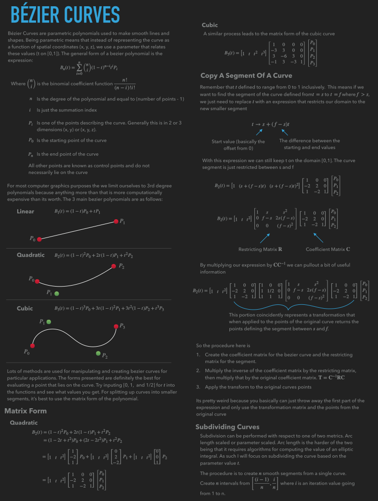

    

    
    

Bez is a swift package aimed at making Bézier curves easy to work with and manipulate. 

The various utilities included are: 
* **Interpolation Functions**
* **Derivatives**
* **Arc Lengths**
* **Segmentation**
* **Subdivision** 
* **Lookup Table Generation**
* **Path Description -> Normalized SwiftUI Shape Conversion**

## Mathematical Background 

## Example Uses 

The `PSlider` component of the [Sliders](https://github.com/kieranb662/Sliders) SwiftUI Library 

   

